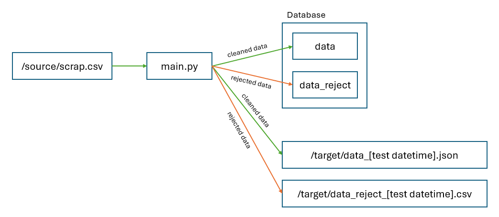
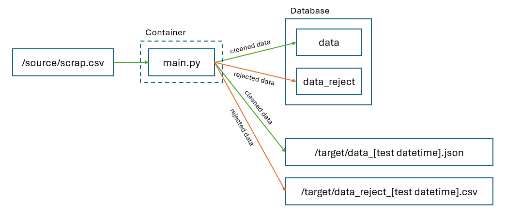
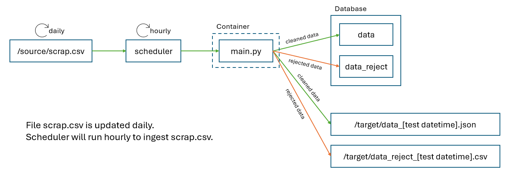

# Technical Test - CSV Data Cleansing

<br>

## Instructions

1.  There will be 3 tests. All tests is <b><u>MANDATORY</u></b>.<br>

2.  You will be given <b><u>8 HOURS to finish all tests.</u></b><br>
    Please do maximize the time you have, stay hydrated, and do not forget to eat your healthy food.

3.  This test requires you to install your own database (for Test 1, 2, and 3), and docker engine (for Test 2).<br>
    Please refer to their documentations to download and install.

    -   [Docker Engine](https://docs.docker.com/engine/install/)
    -   Mysql [Local](https://dev.mysql.com/downloads/installer/) or [Containerized](https://hub.docker.com/_/mysql)
    -   Postgresql [Local](https://www.postgresql.org/download/) or [Containerized](https://hub.docker.com/_/postgres)
    -   ClickHouse [Local](https://clickhouse.com/docs/en/install) or [Containerized](https://hub.docker.com/r/clickhouse/clickhouse-server)
    -   DuckDB [Local](https://duckdb.org/#quickinstall) or [Contanerized](https://hub.docker.com/r/qldrsc/duckdb)

    P.S. only <u>one</u> database needed!

4.  It is <b><u>MANDATORY</u></b> to create <b><u>ONE</u></b> document file as README.md<br>
    which covers both Test 1 and Test 2 with <u>Markdown</u> format.

    The document must contain:

    -   A short explanation about the script.
    -   How to run the script.
    -   Anything you want to explain about the script,<br>
        e.g. How to test, expected result, etc.
    -   Any possible improvements you made.

    P.S. please spare your time to create the document as it will be reviewer <b><u>FIRST FOCUS</u></b>

5.  Please upload the solution to your Google Drive with folder name format:<br> <b>[Your Full Name] - Senior Data Engineer</b>,<br>
    set the general access to “Anyone with the link”, and <b><u>write the share link in body Email</u></b>.

6.  Additional information will be given in Email, please read it carefully.<br>
    <u>If any</u> instruction given via Email contradicts with the instruction above,<br>
    please follow the instruction given in Email.<br>
    We may dynamicly change the instruction via Email.

7.  Please do not hesitate to contact us if you have any questions.

<br>

# Test 1 - Clean CSV Data with Python Script

<br>

## Requirements

You have been given raw CSV data. It has lot of <u>duplicate rows and unproper data type</u>.

Your are assigned to clean, transform, and insert the data into a database table.<br>
The raw CSV file located in:

-   Path: &nbsp;**/source**
-   Name: &nbsp;**scrap.csv**

And, database location is available at:

-   DB Address: &nbsp;**any**
-   DB Port: &nbsp;**any**
-   DB Schema Name: &nbsp;**any**

Also, he ask to create a proper backup CSV and JSON file for duplicate and clean data respectively.<br>
Both file format mentioned below.

There is no specific rules to finish the task,
but he recommend to use <u>Python programming language</u> as it is the common language our division used.<br>

<br>

## Tasks

The overall task can be seen below.



<br>
<br>

1.  Read and clean the CSV file from <b><u>duplicate <i>ids</i></u></b>.<br>
    Record in column <i><u>ids</u></i> has to be unique for all rows.

2.  Insert <u>clean and duplicate record</u> to database table with:

    -   DB Table Name (duplicate data): &nbsp;**data_reject**
    -   DB Table Name (clean data): &nbsp;**data**

    Remember: <u>DB columns must correspond with CSV columns</u> for both tables. Means, if CSV file has 10 columns, so both table does.

3.  Create <u>CSV</u> file for duplicate record with:

    -   Path: &nbsp;**/target**
    -   Name: &nbsp;**data_reject\_[Test Datetime, with format YYYYMMDDHHMMSS].csv**

    The CSV file <u>must have same format</u> with raw CSV file.

4.  Create <u>JSON</u> file for clean record with:

    -   Path: &nbsp;**/target**
    -   Name: &nbsp;**data\_[Test Datetime, with format YYYYMMDDHHMMSS].json**

    The JSON file must follow format below.

    ```json
    {
        "row_count": [integer],
        "data": [
            {
                "dates": [string, with date format YYYY-MM-DD],
                "ids": [string],
                "names": [string, uppercase],
                "monthly_listeners": [integer],
                "popularity": [integer],
                "followers": [integer],
                "genres": [[string], ...],
                "first_release": [string, with year format YYYY],
                "last_release": [string, with year format YYYY],
                "num_releases": [integer],
                "num_tracks": [integer],
                "playlists_found": [string],
                "feat_track_ids": [[string], ...],
            },
            ...
        ]
    }
    ```

    For example, examine how <i>/example/scrap.csv</i> was cleaned and backed up in <i>/example/data_20240302101010.json</i> with duplicate rows stored in <i>/example/data_reject_20240302101010.csv</i>.

## Rules

1.  Write your solution in <i>main.py</i> file given.<br>
    It is allowed to use any PIP module needed, and add more class or function.

2.  The database address, port, and schema is not defined.<br>
    <u>You have to install the database on any location</u>, either in your local machine, VPS, VM, or any cloud provider you have.<br>
    It is <b><u>NOT NECESSARY</u></b> to submit the database address, but you have to submit one DDL script as <i>ddl.sql</i> file which contains SQL create table statement for table <u>data</u> and <u>data_reject</u>.<br><br>
    Please provide screenshots that show the total row count for each tables.

3.  For DB table column type, please choose it properly as it will be considered in assesment evaluation.<br>
    Hint: You can reflect to JSON data type mentioned above.

4.  <b><u>Ensure</u></b> the JSON and CSV file name has proper file name according the <u>test datetime</u>.<br>
    For example:<br>
    If test held on 2 March 2024 10:15:20, the file name suffix has to be <i>data_20240302101520.json</i> and <i>data_reject_20240302101520.csv</i> respectively.

<br>

## Notes

1.  Assessment will be made from:

    -   The <i>main.py</i> and <i>ddl.sql</i> files.
    -   The JSON file contain clean data. It must has correct name, path, and format.
    -   The CSV file contain reject data. It must has correct name, path, and format.

2.  It will be a <b><u>point plus</b></u> if you:

    -   Create any error handler for this task.
    -   Create a test script with PIP module <i>unittest</i> or <i>pytest</i>.
    -   Make any other improvisation <u>which does not violate</u> the given requirements.

<br>
<br>
<br>
<br>
<br>
<p style="text-align: center; font-size: 10pt;">&#8226;&nbsp;&nbsp;&nbsp;&nbsp;&#8226;&nbsp;&nbsp;&nbsp;&nbsp;&#8226;</p>
<br>
<br>
<br>
<br>
<br>

# Test 2 - Containerize the Application with Docker

<br>

## Requirements

Your senior give applause for your work on Test 1. Now, he want to attach <u>hourly</u> schedule to your <i>main.py</i> script in Test 1 using a scheduler deployed in Docker Environment.<br>

It is <b>NOT your task</b> to create the scheduled pipeline.<br>
But, your senior give you task to <b>bundle your application into docker image</b>, and try to <b>run and debug it as a container on your local machine</b> before it will be deployed with schedule.

<br>

## Tasks

The overall task can be seen below.



1. Create a docker image using <i>Dockerfile</i> file, to bundle the application you create on Test 1.

2. Run and debug the docker image using <i>docker-compose.yaml</i> file. Ensure the application is not malfunctioning.

<br>
<br>
<br>
<br>
<br>
<br>
<br>
<br>
<br>

## Rules

1. There is no restriction with <i>Dockerfile</i> file.<br>
   Please consider the base image, and the build steps wisely.

2. There is also no restriction with <i>docker-compose.yaml</i>.<br>
   It is preferrably to use <i>docker-compose.yaml</i> file.<br>
   But, if you choose to use native `docker run ...` command, please write the command in <i>How To Run</i> section on your documentation.

3. It is also not an issue of using Dockerfile COPY command, or VOLUME MOUNT method to mount the <i>/source</i> and <i>/target</i> path. Please consider it wise and reasonably.

4. There is no rule for image and container name. Use any relevant name.

<br>

## Notes

1. Assessment will be made from:

    - The <i>Dockerfile</i> file.
    - The <i>docker-compose.yaml</i> file, or a <i>How To Run</i> section in your documentation.

2. It will be a <b><u>point plus</b></u> if you:

    - Make any other improvisation <u>which does not violate</u> the given requirements.

<br>
<br>
<br>
<br>
<br>
<br>
<br>
<br>
<br>
<br>
<br>
<br>
<br>
<br>
<br>
<br>
<br>
<br>
<br>
<br>
<br>
<br>

# Test 3 - Implementation on any Scheduler

<br>

## Requirements

There is no requirements necessary for Test 3. Prepare <b><u>ONE</u></b> comprehensive ideas.

<br>

## Tasks

Write your idea (and insert any visual, or chart if necessary) in a file from this question:

<br>

-   <b>How to schedule/implement work you have done on Test 1 and Test 2 with a scheduler?</b>

-   <b>How you will handle any possible issue might happen with the data (like duplicate data in DB because each scheduler runs may ingest the same data from scrap.csv) after the the pipeline being scheduled?</b>

<br>

Your idea can be developed from the assumptions below (but not limited to):

1. Scheduler can be <b><u>ONE</u></b> from list below (but not limited to):

    1. Basic [Cron](https://en.wikipedia.org/wiki/Cron)
    2. [Apache Airflow](https://airflow.apache.org/)
    3. etc

2. The schedule will be scheduled <u>hourly</u>.

Also, you are allowed to add more assumptions to build your idea.

To make it easier, you can see diagrams below.



<br>

## Rules

1. You can start to prepare your answer right after you submit your assignment for Test 1 and Test 2, until interview session.

2. You can bring any helpers like diagram or flowchart during the interview to help you better explain your idea.

3. It is <u>not necessary</u> to create any script related with the tools.

<br>

## Notes

1. The test form is discussion during interview session. Hence, it is not necessary to make any document for your idea. <br>
   Assessment will be made from the discussion.
