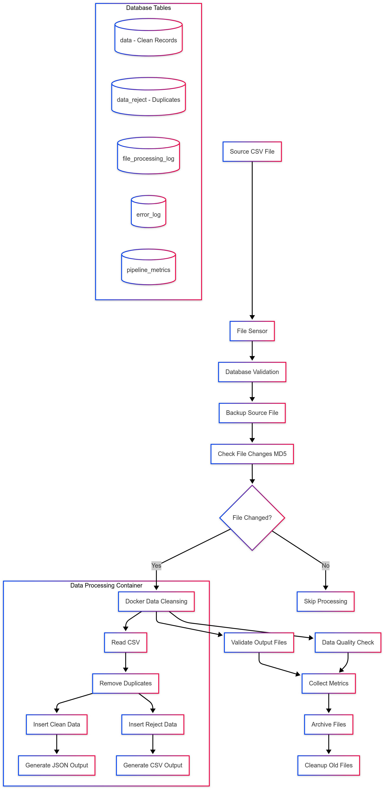

# CSV Data Cleansing Pipeline with Apache Airflow

## Overview

This project implements a comprehensive data cleansing pipeline using Apache Airflow as the scheduler, Docker for containerization, and PostgreSQL as the database backend. The pipeline processes CSV files hourly, performs data deduplication, and maintains data quality through automated monitoring and error handling.

## Architecture

```

```

## Features

### **Automated Scheduling**
- **Hourly execution** (every hour at 00 minutes)
- **File change detection** using MD5 hashing to prevent duplicate processing
- **Smart skipping** when no new data is available

### **Data Quality & Integrity**
- **Duplicate detection** based on unique IDs
- **Data type validation** and transformation
- **Comprehensive error handling** with logging
- **Output file validation**

### **Monitoring & Metrics**
- **Pipeline metrics collection** (processing time, success rates, record counts)
- **Error logging** with detailed stack traces
- **Health checks** for all services
- **Data quality reporting**

### **Data Management**
- **Automatic backup** of source files with timestamps
- **Archive management** for processed files
- **Cleanup of old files** (7-day retention policy)
- **Separate storage** for clean and rejected data

## Project Structure

```
project/
├── dags/
│   └── csv_data_cleansing_pipeline.py    
├── source/
│   └── scrap.csv
├── target/          
├── backup/ 
├── archive/ 
├── logs/
├── main.py 
├── ddl.sql 
├── docker-compose.yaml 
├── Dockerfile 
├── requirements.txt 
├── deploy.sh  
├── init-databases.sh 
└── pytest.ini 
```

## Database Schema

The pipeline uses PostgreSQL with the following tables:

### Primary Tables
- **`data`**: Clean, deduplicated records with unique IDs
- **`data_reject`**: Duplicate records that were filtered out

### Management Tables
- **`file_processing_log`**: Tracks processed files using MD5 hashes
- **`error_log`**: Stores pipeline errors and exceptions
- **`pipeline_metrics`**: Performance and quality metrics

## How to Run

### Prerequisites
- Docker & Docker Compose installed
- At least 4GB RAM available
- 2GB free disk space

### Quick Start

1. **Clone and prepare the project:**
```bash
git clone <repository>
cd data-cleansing-pipeline
```

2. **Place your CSV file:**
```bash
# Copy your CSV file to the source directory
cp scrap.csv source/scrap.csv
```

3. **Deploy the pipeline:**
```bash
# Using the deployment script
chmod +x deploy.sh
./deploy.sh

# OR manually
docker-compose down -v
docker-compose up --build -d
docker build --no-cache -t data-cleaner:latest .
```

4. **Access services:**
- **Airflow UI**: http://localhost:8080 (admin/admin)
- **PgAdmin**: http://localhost:8081 (admin@example.com/admin)

### Manual Execution

To run data processing without Airflow:

```bash
# Uncomment the CMD line in Dockerfile
docker run --rm \
  --network data-network \
  -v $(pwd)/source:/source:ro \
  -v $(pwd)/target:/target \
  -v $(pwd)/logs:/app/logs \
  -e DB_HOST=postgres \
  -e DB_PORT=5432 \
  -e DB_NAME=data_cleansing \
  -e DB_USER=postgres \
  -e DB_PASSWORD=password \
  data-cleaner:latest
```

## Configuration

### Environment Variables
```bash
DB_HOST=postgres
DB_PORT=5432         
DB_NAME=data_cleansing   
DB_USER=postgres      
DB_PASSWORD=password     
EXECUTION_DATE=2025-06-14 
```

### Docker Compose Services
- **postgres**: PostgreSQL database
- **airflow-init**: Airflow database initialization
- **airflow-webserver**: Airflow web interface
- **airflow-scheduler**: Airflow task scheduler
- **data-cleaner**: Data processing container
- **pgadmin**: Database administration interface

## Pipeline Tasks

### 1. **File Detection** (`check_source_file`)
- Monitors `/source/scrap.csv` for availability
- Waits up to 10 minutes with 30-second intervals

### 2. **Database Validation** (`validate_database`)
- Verifies PostgreSQL connection
- Ensures database is ready for operations

### 3. **Source Backup** (`backup_source_file`)
- Creates timestamped backup of source file
- Stores in `/backup/` directory

### 4. **Change Detection** (`check_file_changes`)
- Calculates MD5 hash of source file
- Skips processing if file unchanged
- Prevents duplicate data insertion

### 5. **Data Processing** (`run_data_cleansing`)
- Runs containerized Python script
- Performs deduplication and transformation
- Inserts data into database tables

### 6. **Output Validation** (`validate_output_files`)
- Verifies JSON and CSV output files exist
- Ensures proper file naming convention

### 7. **Quality Checks** (`data_quality_check`)
- Validates record counts in database
- Ensures data integrity

### 8. **Metrics Collection** (`collect_metrics`)
- Records pipeline performance data
- Tracks success rates and processing times

### 9. **File Archiving** (`archive_processed_files`)
- Moves output files to archive directory
- Organizes by execution timestamp

### 10. **Cleanup** (`cleanup_old_files`)
- Removes files older than 7 days
- Maintains disk space efficiency

## Data Processing Logic

### Input Format (CSV)
```csv
dates,ids,names,monthly_listeners,popularity,followers,genres,first_release,last_release,num_releases,num_tracks,playlists_found,feat_track_ids
```

### Output Formats

**Clean Data (JSON):**
```json
{
  "row_count": 150,
  "data": [
    {
      "dates": "2025-06-14",
      "ids": "unique_id_123",
      "names": "ARTIST NAME",
      "monthly_listeners": 1000000,
      "popularity": 85,
      "followers": 500000,
      "genres": ["pop", "rock"],
      "first_release": "2020",
      "last_release": "2024",
      "num_releases": 5,
      "num_tracks": 50,
      "playlists_found": "popular_playlists",
      "feat_track_ids": ["track1", "track2"]
    }
  ]
}
```

**Rejected Data (CSV):**
- Same format as input CSV
- Contains duplicate records based on `ids` column

## Monitoring & Troubleshooting

### Health Checks
```bash
# Check service status
docker-compose ps

# View logs
docker-compose logs -f airflow-scheduler
docker-compose logs -f data-cleaner
```

### Database Monitoring
```sql
-- Check processing statistics
SELECT * FROM pipeline_metrics ORDER BY created_at DESC LIMIT 10;

-- View error logs
SELECT * FROM error_log ORDER BY created_at DESC;

-- Check file processing history
SELECT * FROM file_processing_log ORDER BY created_at DESC;
```

### Common Issues

1. **File Not Found Error:**
   - Ensure `scrap.csv` exists in `/source/` directory
   - Check file permissions (readable by container)

2. **Database Connection Error:**
   - Verify PostgreSQL service is running
   - Check network connectivity between containers

3. **Memory Issues:**
   - Increase Docker memory allocation
   - Monitor container resource usage

4. **Duplicate Processing:**
   - Check `file_processing_log` table
   - Verify MD5 hash calculation logic

## Testing

### Unit Tests
```bash
# Run tests
docker run --rm -v $(pwd):/app -w /app python:3.8 \
  bash -c "pip install -r requirements.txt && python -m pytest -v"
```

### Integration Tests
```bash
# Test complete pipeline
docker-compose exec airflow-scheduler airflow dags test csv_data_cleansing_pipeline $(date +%Y-%m-%d)
```

## Security Considerations

- **Database credentials** stored in environment variables
- **Non-root user** in data processing container
- **Read-only mounts** for source files
- **Network isolation** using Docker networks

## Performance Optimization

### Current Optimizations
- **Database indexing** on frequently queried columns
- **Connection pooling** for database operations
- **Efficient pandas operations** for large datasets
- **Memory-mapped file operations** for large CSV files

### Scalability Improvements
- **Parallel processing** for multiple files
- **Database partitioning** by date
- **Horizontal scaling** with Airflow workers
- **Cloud storage integration** for large files

## Improvements Made

### Error Handling
- **Comprehensive exception handling** throughout the pipeline
- **Detailed error logging** with context information
- **Graceful failure recovery** with retry mechanisms
- **Error notification** through Airflow alerts

### Data Quality
- **MD5-based change detection** prevents duplicate processing
- **Data type validation** ensures schema compliance
- **Output file validation** confirms successful processing
- **Metrics collection** for monitoring data quality trends

### Operational Excellence
- **Automated backup strategy** for source files
- **Archive management** with configurable retention
- **Health checks** for all services
- **Deployment automation** with single script

### Container Optimization
- **Multi-stage builds** for smaller images
- **Security hardening** with non-root users
- **Resource constraints** to prevent memory issues
- **Volume mounting strategy** for persistent data

## Future Enhancements

1. **Advanced Monitoring:**
   - Integration with Prometheus/Grafana
   - Custom alerting rules
   - Performance dashboards

2. **Data Validation:**
   - Schema validation with Great Expectations
   - Data profiling and anomaly detection
   - Custom data quality rules

3. **Scalability:**
   - Kubernetes deployment manifests
   - Distributed processing with Spark
   - Cloud-native storage integration

4. **Security:**
   - Secret management with Vault
   - RBAC implementation
   - Audit logging

5. **CI/CD Pipeline:**
   - Automated testing pipeline
   - Docker image vulnerability scanning
   - Infrastructure as Code with Terraform

## Support

For issues or questions:
1. Check the error logs in the database
2. Review Airflow task logs in the UI
3. Examine container logs with `docker-compose logs`
4. Verify file permissions and network connectivity

## License

This project is part of a technical assessment and is intended for evaluation purposes.